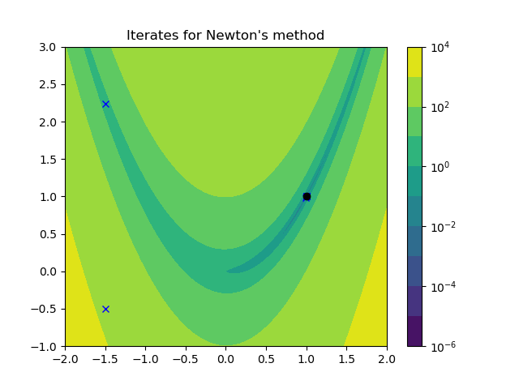
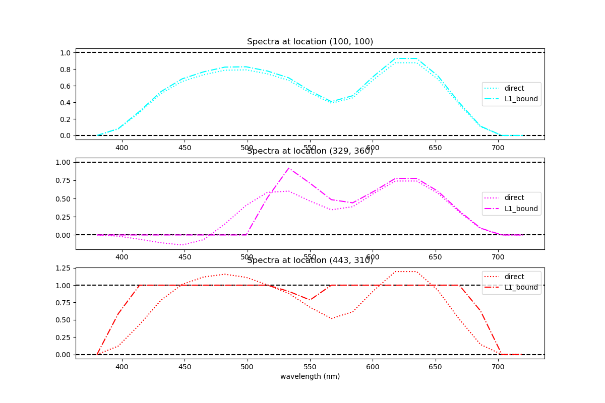
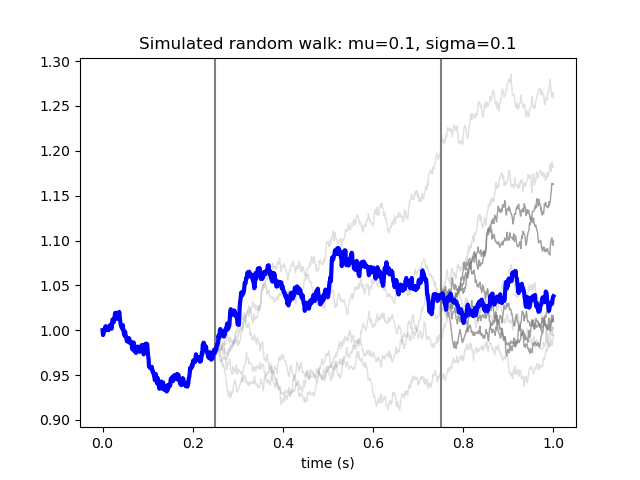
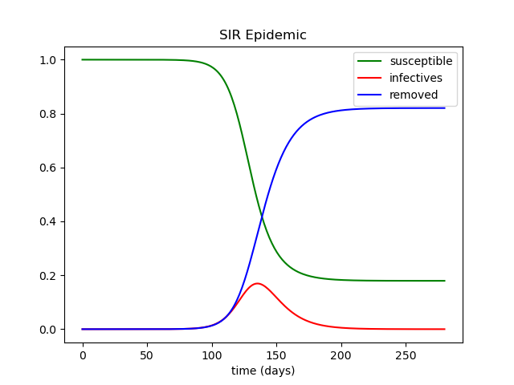

# NLOPS : General purpose solver for nonlinear L1/L2 inverse problems
A Python package for solving constrained inverse problems of the form

```math
m^{*}=\textrm{argmin}_m \left[\|d - g(m)\|_2^2 + \lambda R(m)\right],
```
where $d$ represents the recorded data, m is the (usually physical) model, $g$ is a simulation of the data and $R$ is an arbitrary regularization constraint on the model. $\lambda$ is a scalar and represents the regularization weight. Amongst the classical choices for $R$ are,\

```math
R(m) = \| m - m_0\|_2^2, 
```
corresponding to Tykhonov regularization. Other choices are,
```math
R(m) = \| m \|_1, 
```
corresponding to the generalized Lasso penalty functon, and total-variation denoising,
```math
R(m) = \| \nabla m\|_1. 
```
Many more interesting examples can be found at https://web.stanford.edu/~boyd/papers/pdf/admm_distr_stats.pdf

## Functionality
Source code has been subdivided into three folders, ```operators```, ```objectives``` and ```solvers```. Each has their own test barage formulated through the pytest framework.

### Operators
An operator is a general map, g, 
```math
g : m \to d.
```
g may depend nonlinearly on m. When $g$ is a linear operator on $m$ we usually think of it as a matrix operator. At any point $m_0$ we have the Jacobian, $G$, such that,
```math
G_{ij} = \left [ \nabla_m g \right]_{ij}=\left.\frac{\partial g_i(m)}{\partial m_j} \right |_{m=m_0}.
```
and $G$ has an adjoint, defined by,
```math
G^{T}_{ij}=G_{ji}.
```
Various operator objects can be constructed as,
 - ```matrix.py``` : Matrices (Linear Operators) 
 - ```chain.py``` : Nonlinear-chains, $g=g_1 \circ g_2 \circ \ldots \circ g_m$
 - ```vector.py``` : Vectors, $g = [g_1 , g_2 , \ldots , g_m]$
 - ```symbolic.py``` : Wraps sympy expressions into operator consistent format- powerful but slow

### Objectives
The main objective object is the L2 fit, defined in ```base.py```,
```math
\mathcal{L}: m \to \mathbb{R} \hspace{0.2cm} \textrm{where} \hspace{0.2cm} \mathcal{L} = \|d - g(m)\|_2^2.
```
Any implemented objective must calculate both a value, $\mathcal{L}$,  and its gradient, $\nabla \mathcal{L}$, where
```math
\nabla L_i = \frac{\partial \mathcal{L}}{\partial m_i}.
```
Sums of objectives are defined in ```sum_objective.py```,
```math
\mathcal{L} = \mathcal{L}_0 + \mathcal{L}_1 + \ldots + \mathcal{L}_m.
```
### Solvers
Once an objective object is defined we can solve the corresponding inverse problem
```math
m^{*}=\textrm{argmin}_m \left[\mathcal{L}(m)\right].
```
 - ```general.py``` provides ```GeneralSolver``` wrapping Scipy's minimize library https://docs.scipy.org/doc/scipy/reference/generated/scipy.optimize.minimize.html. Providing easy access to NLCG and BFGS algorithms. 
 - ```direct.py``` solvers the inverse problem via a Cholesky decomposition of the Hessian. This approach is not appropriate for large scale problems.
 - ```admm.py```. Neither of theses approaches is valid for L1 regularizers. To this end we supply an ADMM solver.

## Examples

Examples are illustrated through notebooks. Varying levels of sophistication.

#### Rosenbruck

Simplest example which uses Sympy to evaluate Newton's method to find the global minimum, at (1,1), of the Rosenbruck function
```math
\mathcal{J} = (1-x)^2 + 100.0*(y-x^2)^2.
``` 



*Rosenbrock function with global miniumum at (1.0,1.0). Blue crosses show iterates of Newton's method, starting from (-1.5,-0.5).*

#### HSI

Hyperspectral reconstruction over the visible spectrum from RGB data. Given three channel data (R, G, B) and a knowledge of the spectral response function for each channel,
```math
F_{R,G,B}: \lambda \to d_{R,G,B}.
```
We can determine the full spectral data, $m_{\lambda}$, by solving the inverse problem,
```math
\mathcal{J}=\|d_{RGB} - F_{RGB} m_{\lambda}\|_2^2 \hspace{0.3cm} \textrm{(L2)}.  
```
However, this problem is highly underdetermined and so extra constraints are required. Furthermore, in applications one is typically interested in an objects reflectance which is strictly bounded between $0$ and $1$. Since an object cannot reflect less than no energy, or more energy than fell on it! 

There are a number of ways of enforcing such a reflectance constraint, for instance, solving
```math
\mathcal{J}=\|d_{RGB} - F_{RGB} m_{\lambda}\|_2^2 + \lambda \| R(m_{\lambda}) \|_1 \hspace{0.3cm} \textrm{(L1-bound)}. 
```
where
```math
R(m) = \begin{cases}
- m,  \hspace{0.2cm} \textrm{for} \hspace{0.2cm} m < 0,\\
0 ,  \hspace{0.2cm} \textrm{for} \hspace{0.2cm} 0 < m < 1,\\
m -1, \hspace{0.2cm} \textrm{for} \hspace{0.2cm} m > 1.
\end{cases}
```
This and other approaches are investigated in ```hsi_reconstruct.py```. 



*Reconstructed spectra at various point of an RGB image. `Direct` refers to a direct solve of the least-squares data fitting term (L2), whilst `L1-bound` solves the bound constrained problem under an L1 norm.*

#### Euler-Maruyama

At present these are modelling illustrations rather than actual inverse problems. The point is to model data according to some Stochastic differential equation,
```math
\Delta x(t) = \mu(x,t) x(t) \Delta t + \sigma(x,t) \Delta W_t,
```
where $W_t$ is a Wiener process. From a signal processing perspective this is interesting as it provides a very general noise model. It is also important in financial mmathematics (generally) and portfolio modelling.

I experimented with the Euler-Maruyama method as it is the simplest numerical method to evaluate such SDEs. 



*Simulated random walks. Blue starting at 1.0 at t=0.0s. Other walks are simulated at t=0.25s and t=0.75s respectively.*

The link to inverse problems is currently incomplete. This is due to a mix of time constraints, lazyness and technical details. However, given noisy data, $d(t)$, the task is to fit $x(t)$ to $d$ to determine $\mu$ and $\sigma$. On the technical side, I need to learn a little more about Kolmogorov's forward and backward equation. To be continued.

#### SIR

An example from epidemic modelling.  By splitting a population into three compartments, 

 - $S$ - susceptibles, not infected and not immune,
 - $I$ - infective, 
 - $R$ - removed, immune or deceased, 
 
an epidemic can be modelled as a differential equation describing the evolution of the population through these compartments. In maths,

```math
\partial_t S = -\alpha S I, \\

\partial_t I = \alpha S I - \beta R, \\

\partial_t R = \beta R.
```
In short $S \to I \to R$, $\alpha$ says how infectious the epidemic is whilst $\beta$ is the rate of recovery. 



*Evolution of susceptible, infective and removed compartments with time. Values are plotted as a fraction of the total population. Here $\alpha$=0.23 and $\beta=0.11$*

There is alot more to say here, better models of epidemics are SEIR which includes an exposed phase (infected, not yet infectious), or SIRS which allows immunity to slacken over time so that $R$ falls back to $S$. For COVID19 one can allow multiple infectious compartments where the infectivity and recovery functions vary depending on how long someone has had the disease.

From an inverse problems point of view we can pose the problem of regularly sampling say 10% of the population to estimate $\widehat{I}_t$. Then fit a modelled $I_t$ to $\widehat{I}_t$ in order to get the parameters $I_0, \alpha, \beta$. This will then determine the course of the epidemic. This of course owes alot to events happening in the world when I first started planning this library!  This is a highly nonlinear inverse problem which is explored in ```sir_inference.py```.

## ToDo
### Software improvements
- Docstrings!
- Ruff, mypy and coverage tests
- Consolidate solver into general Polymorphic class.
- C++ operator support. See https://github.com/bveitch/CPPY for how this can be done.


### Technical
- More complete constraint handling in ```admm.py```
- Multi-stage SIR, SEIR model. Improve results with additional $\widehat{R}$ dataset.
- Link Euler-Maruyama to inverse problems for market calibration.

## Installation
```
conda env create -f environment.yml
```

```
conda activate nlops
```
## Running tests
```
pytest src/objectives/tests/test_objectives.py
pytest src/operators/tests/test_operators.py
pytest src/solvers/tests/test_solvers.py
```
